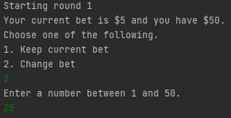
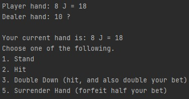
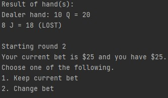

# 1.1 Blackjack Game Clone Overview

**Overview written by Peter Mitchell.**

## Contents

```
1.1 Blackjack Game Clone Overview
1.2 Introduction
1.3 The Rules of Blackjack
1.4 High Level Discussion About Implementation
1.5 How the Core Game Works
1.6 Features You Could Add
```
# 1.2 Introduction

This document will explain the fundamentals of how the Blackjack game works. 

# 1.3 The Rules of Blackjack

Blackjack is a well-known gambling game played in casinos. There are only a few simple rules to follow,
and a lot of the game is luck, although you can employ memory techniques with card counting to try
and gain an edge. The following list summarises the rules.

- The game starts with a dealer, a player, and a deck of cards.
- The player at the start of each round can place a bet before the cards are dealt.
- Cards are dealt to the dealer and player until each have two. The player’s cards are both
    revealed, but the second of the dealer’s cards remains face down.
- The player can choose what to do with their hand. They can stand meaning they leave the
    hand as it is. They can hit, meaning they request another card from the deck. They can double
    down meaning they hit, but also double the bet. They can split if there is a pair for their two
    cards (the bet is split, and each hand is played independently). Or they can surrender the hand
    to take back half their bet and not play the hand. The player can continue to hit as many times
    as they wish until they choose another option, or they go bust.
- After all the hands are played the dealer reveals their hidden card and continues to hit until
    they have 17 or higher score.
- The score of hands is determined by the value on the card, or 10 for J, Q, or K. And for A it can
    be either 1 or 11 for maximising the score.
- The player wins if they scored higher than the dealer and have a hand value of 21 or less. They
    receive double the bet amount as winnings.


# 1.4 High Level Discussion About Implementation

The game has been split into three class files. Representing a DeckOfCards, a Hand, and the core
Game. All the gameplay management happens inside the Game class and is supported by multiple
instances of the Hand class and a single DeckOfCards to supply cards for the hands.

The game starts each round like in the image below with showing how much the last bet was set at
(defaults to $5), and how much cash the player has still (starts at default of $50).



After the player has entered their bet choice the cards are dealt as seen below and the player is
prompted with the options available to them.



When the round is complete with all hands evaluated the hands are shown with their results as seen
below and the next round continues assuming there is still cash for the player to use.



# 1.5 How the Core Game Works

The three classes will be individually discussed briefly in order of how they are used. The DeckOfCards
makes the most sense to look at first because it is used to provide all the cards to the Game and Hand
classes. Then the Hand class will be discussed as it is used a lot throughout the implementation of the
Game class. And finally, the Game class ties everything together with a structured set of methods to
provide the flow of the game.

The DeckOfCards class provides a way to represent a deck of randomly shuffled cards that just has the
face value of those cards. The suit is not included because it is not relevant to this game, although you
could include it easily. The deck consists of a list of Strings and the methods provide functionality to
fill, shuffle or retrieve cards. The following methods summarise what is contained in the class.

- fillDeck(): Fills the deck with 52 cards with 4 of each face value in ascending order.
- shuffleDeck(): Randomly shuffles the deck list.
- drawCard(): Checks if the deck is empty and fills a new shuffled deck if it is, and then draws
    the top card to return it.

The Hand class is used to represent the cards that have been drawn from the deck to be associated
with a specific hand. Whether that be the dealer or player the same class is used. The class also tracks
how much of a bet has been associated with the hand so that winnings can be distributed
appropriately based on the outcome. This is important for if the hand is split so that each hand can
individually be awarded winnings based on their outcome. It would also allow for multiple players
potentially in the same kind of way. The following methods are used to provide behaviour to the class.

- addCard(): Adds the specified card to the list of cards in the hand and then recalculates the
    maximum value for the hand.
- setBet(): Changes the bet to a specified to value for the hand.
- getBet(): Retrieves the current bet for this hand.
- revealHand(): Used for the dealer to reveal the hidden second card once it reaches the dealer’s
    turn.
- getHandValue(): Returns the maximum hand value that was calculated by the
    calculateMaxValueOfHand() method.
- canSplit(): Checks if the hand can be split. Hand must have a pair and the bet for the hand
    must be more than $1 because only whole numbers can be split.
- getSplitHand(): Performs a hand split and returns the newly split hand. It splits the bet equally
    between them.
- calculateMaxValueOfHand(): Adds up all the cards based on their face values first assuming
    that A is worth 1 and then testing if adding +10 for each ace will take the total over 21.
- toString(): Used to retrieve a String version of the hand showing all the cards in it.


The Game class has many methods in it so they will be broken up into a few different types of methods.
The class maintains references to a deck, hands for the player and dealer, and the amount of cash the
player has. The first methods that will be covered are those that provide the highest level of what
happens during the game.

- start(): Begins the game by looping calling playRound() until the player has run out of cash.
- playRound(): Steps through each part of a round by taking the player’s bet, dealing out the
    cards, showing the initial state of the hands, letting the player and dealer have their turns and
    then showing the results. These are all separated into individual methods.
- playerTurn(): Continues looping until all hands that the player controls have been evaluated.
    Normally this will just be one, but if it is split the result will be multiple hands. This method
    branches off to many methods that will be discussed as part of the next section of methods.
- dealerTurn(): Deals cards for the dealer until they have a score of 17 or higher.
- dealStartOfRound(): Takes the player’s bet and assigns it to a hand with cards for both the
    player and ones also for the dealer.
- showPlayerHands(): Prints out all the hands the player has.
- setBet(): Gives the player a choice of keeping their current bet or modifying it to any number
    between 1 and all their cash.
- checkRoundResults(): Checks for each of the player’s hands what the resulting outcome is with
    evaluateHandResult() and applies the outcomes.

The next set of methods to look at are those used by the above methods to provide lower down
functionality. Particularly for the playerTurn there are many smaller actions taken that have been
broken down into individual methods.

- drawCardsToHand(): Draws a specified number of cards to a specified hand. This is used to
    draw two cards to each hand at the start of the game and then one each time a hit is
    performed.
- performSplitChoice(): Is called when the player has selected to split during their turn. This
    method tells the hand to split and adds the new hand to the player’s list of hands.
- evalualteHandResult(): Checks what the outcome is for a specified hand and passes out
    winnings if there are any.
- doubleHandBet(): Called when the player selects to double down on a specified hand. The bet
    on that hand is doubled and taken from the player’s available cash.
- foldHand(): Returns half the cash to the player for the specified hand and then sets the bet for
    that hand to 0.
- promptPlayerAction(): Takes a specified hand and provides a list of possible options to take
    using the getQuestionAnswer() method.

The last set of methods are those that provide additional help functionality related to input used by
the other methods.

- getQuestionAnswer(): Asks a question and continues to ask it until any of the valid responses
    have been entered. Used for setBet() and for promptPlayerAction().
- getIntInputInRange(): Asks a question requiring a number between a min and a max and
    continues to ask it until a valid input has been received. Used for setting the bet.
- quitOrGetString(): Used in both the getQuestionAnswer() and getIntInputInRange() to check
    for a “q” or “quit” to make the game quit during other input.


# 1.6 Features You Could Add

The core game does not have a lot that can be changed to make the game itself more novel without
changing the way it works. You could look at adding many different features though or turning it into
an entirely different experience. The following list summarises some of the many options you could
consider applying yourself to extending this base game.

- Change from a CLI game to a GUI so that everything is far more visual and easier to follow.
- Improve the DeckOfCards class so that it can store suits as well and implement other card
    games.
- Add support for more players. Currently it is just one player and one dealer. You could try
    adding additional players even if they are all played by you.
- Add a goal to win the game. It could be a million dollars or any higher amount you like.
- Add your own rules to change the game in some small or dramatic way.
- Come up with your own other features to add and improve the game.


